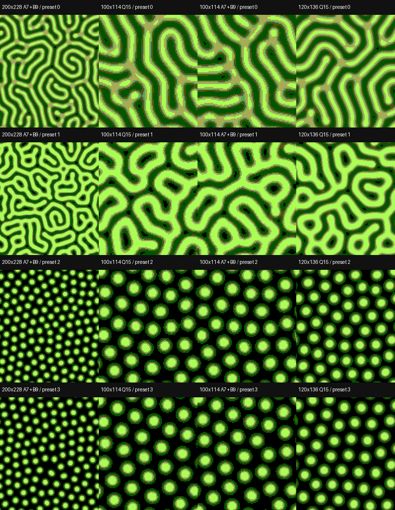
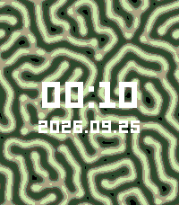

# Validation and adoption status

The implementation is available for local Web use and Emery builds. Production adoption is **pending**, because no physical Pebble Time 2 is connected and interactive Web browser verification is unavailable in this environment.

## Completed checks

- Native C row-buffer updates match a full-screen double-buffer oracle for all three modes.
- Native and Wasm field hashes match at steps 0, 1, and 100 with seed 42, including stochastic rounding.
- Equilibrium, periodic seeding, coefficient endpoints, rounding ties and statistical bias, invalid arguments, undersized allocation, alignment, and sentinel boundaries are tested.
- AddressSanitizer, UndefinedBehaviorSanitizer, and LeakSanitizer passed. LeakSanitizer requires execution outside this environment's ptrace-based sandbox.
- 300 allocation/reset cycles retain fixed Wasm linear memory. The TypeScript adapter is tested with real Wasm for loading, mode recreation, parameter conversion, stepping, seeding, RGBA output, and disposal.
- The original Float32 reference tests passed.
- TypeScript checking and the production Web build passed. The repository-wide `mise run lint` passes. Vendored `components/ui/` is excluded from oxlint, as described in `docs/development.md`.
- Wasm was served with HTTP 200 and `application/wasm`.
- Both Emery `.pbw` variants were built and installed in the emulator. Mode 0 was also observed after a back-button backlight animation and subsequent minute updates without a lower minimum free heap.
- The Emery screenshot's 2,427 white clock/date pixels exactly match the extracted PBF glyph positions and bitmap pixels. There are zero missing or extra white pixels. This verifies font geometry against the emulator, not browser Canvas interaction.

Machine-readable results and comparison images are in `public/reports/`. These are also linked from the local Web UI. Source for all numerical checks is under `tests/`.

## Pattern comparison

For the cell-by-cell comparison with the original Float32 implementation, see [Float32 precision comparison](float-precision.md). The optimized fixed-point implementation is not numerically identical to the Float32 reference.

The Web now exposes Float32 reference runs at both grid resolutions alongside the two production Wasm modes. The adapter test checks that its initial disk occupancy matches the C core in both grids and that Q15 initial values match exactly on the 100 × 114 grid. Its step, seed, and RGB2 rendering paths are also exercised. The UI switches by resetting to the same seed and preserves the original controls.

The [thin-line comparison image](../public/reports/thin-lines.png) records seed 42, Feed 0.023, Kill 0.052, Da 1, Db 0.5, dt 1, and 10,000 steps. The left half is 200 × 228 / 8-bit and the right half is 100 × 114 / Q15, both displayed at 200 × 228. The high-resolution result has narrow curved bands while the low-resolution result has wider bands. The separate [Float32 precision report](float-precision.md) quantifies this preset at 1,000 steps.

Each of four presets was run for 10,000 steps with seeds 42 and 1234 in modes 0, 1, and 2. All 24 runs retain spatial variance and changing concentration cells at the end of the run. None was fully frozen or uniform at that checkpoint. This is a bounded observation, not a guarantee for every setting or an arbitrarily long run.

The 200 × 228 / 8-bit version has finer pattern geometry. The 100 × 114 / 16-bit version has larger visible structures due to its grid scale. The diagnostic 100 × 114 / 8-bit images isolate storage precision at the same resolution. Their structure resembles the 16-bit comparison while retaining stochastic temporal noise.

At step 10,000, a further single step changes about 0.8–1.4% of displayed pixels for the 8-bit candidates. The 16-bit candidate changes 0–0.009% of displayed pixels in those cases. This is a one-step RGB2 pixel-change statistic, not a perceptual flicker score. On-watch animation and visibility still need assessment.

## Memory

Core allocation is 93,647 B for mode 0 and 48,047 B for mode 1. These include scratch and rendering rows, control state, and alignment. Concentration planes plus scratch rows alone occupy 90.625 KiB and 46.094 KiB respectively.

The current `public/reports/comparison.json` records measured ELF text/data/BSS and compiler stack reports. Application RAM estimates use the 128 KiB app region and subtract both the load footprint and the core allocation. They do not include additional OS allocations.

Observed emulator heap results are recorded with their build/observation scope. Mode 0 showed 32,888 B after startup and two subsequent minute updates. Mode 1 showed 78,688 B after startup and a subsequent minute update. The observation metadata is retained in `docs/emulator-measurements.json`. These exceed 16 KiB in the observed emulator intervals, but they are not a substitute for a sustained normal-operation and backlight workload on hardware. Use the current report for subsequent measurements.

The Float32 precision check prompted a validation guard in `rd_init`. The two `.pbw` files were rebuilt after it. Their current ELF section sizes are refreshed in `public/reports/comparison.json`. The heap observations above belong to the earlier binaries listed in `docs/emulator-measurements.json` and should be remeasured on the final binaries before an acceptance decision.

Compiler `.su` files report bounded, static frames and no application recursion. The report includes their sum as a deliberately conservative application-only stack bound. This is not a full stack high-water measurement. The OS and library call paths contribute additional stack usage.

## Timing limitation

The emulator RTC implementation in the inspected official PebbleOS source (`src/fw/drivers/qemu/qemu_rtc_hal.c`) obtains whole seconds and fractional milliseconds from different clock sources. The observed combined timestamp can move backwards across a tick wrap. Diagnostics now abort that compute slice, set `clock_invalid=1`, and report a 1,000 ms sentinel. Once invalid, maximum timing fields cannot be used as performance measurements. The sentinel is not a measured 1,000 ms step.

Backlight windows use a separate five-second AppTimer, so they do not depend on this wall-clock combination. Compute time is checked only after a complete step. A slow single step can exceed the nominal 8 ms slice budget, which makes physical-device timing an essential remaining check.

## Remaining acceptance work

- Verify Web mode switching, repeated initialization, pause/advance behavior, simulated backlight/focus behavior, PNG export, and configuration downloads interactively. No connected browser is available to this agent.
- Observe real-device backlight-on/off and focus loss, without an accelerometer subscription.
- Measure minimum free heap throughout startup, minute updates, and backlight animation. Require at least 16 KiB during normal operation.
- Measure compute and draw times on a physical Emery watch. Require combined animation compute and drawing to fit within 100 ms.
- Validate full stack headroom including OS and library contributions.
- Compare perceived flicker, legibility, and pattern quality on the physical display.

If both candidates pass, use mode 0 as the standard. If mode 0 fails the memory or timing gate and mode 1 passes, use mode 1. The Web currently starts with mode 0 as a provisional comparison default. Both build outputs remain available.

## Emulator rendering after startup

