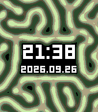
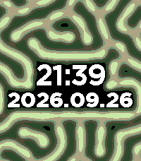
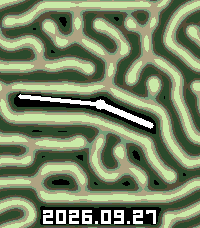

# Validation and adoption status

Mode 3 (120 × 136 Q15 cells shown with interpolated rendering) is the production watch build: `pebble/src/c/config.h`, the build default, `pnpm run device`, and the Web's initial selection use it. Mode 1 (100 × 114) remains available as the previous build and mode 0 (200 × 228 with packed codes) as the high-resolution comparison build. The measurements below are of the production build on a physical Pebble Time 2 through the phone's developer connection, from a build made with `RD_BUILD_LOG=1`. `docs/hardware-measurements.json` holds the entry and `scripts/build-report.py` copies it into `public/reports/comparison.json`.

## Checks

- Native C row-buffer updates match a full-screen oracle for all four modes (0 to 3), with and without a clock mask. The oracle keeps its own encoder and the documented error diffusion on a plain residual row.
- Native and Wasm field hashes match at steps 0, 1, and 100 with seed 42 for every mode, after 200 masked steps with each font and with each face, and for the interpolated rows of every mode. Every build matches `tests/golden-hashes.txt` at `-O0` and `-O3`, including the analog face masks of modes 0, 1, and 3.
- The analog face is tested for invalid arguments without writing, drawing equal to the halo 0 mask for both fonts, the capsule scan against the exact distance test for every angle of both hands, the geometry of all 720 times (hands within columns 18 to 182 and rows 22 to 186, an empty gap above the date rows), left-right and top-bottom mirror symmetry, the halo and grid splat at widths 100, 120, and 200, the sweep ends, direction, and wrap through 1439 to 0, and, in the adapters, the analog mask against the JS splat of the face bitmap and B = 0 under the hands in the Wasm and Float32 engines.
- Equilibrium, periodic seeding, coefficient endpoints, rounding ties, the saturation edge of the B rate, the integer square root over its whole domain, floor codes, the dithered threshold range, error diffusion mass conservation, the interpolation reference, the clock mask levels and glyph pixels, invalid arguments, undersized allocation, alignment, and sentinel boundaries are tested.
- AddressSanitizer, UndefinedBehaviorSanitizer, and LeakSanitizer passed. LeakSanitizer requires execution outside a ptrace-based sandbox.
- Every palette channel is the nearest integer to the exact interpolation between its stops, lime, cyan, and monochrome keep the colors of the earlier renderer, the custom palette takes the stops of `rd_palette` and drops a stale lookup table, and every pixel of the Wasm rendering equals the `lib/palettes.ts` color for each built-in palette and custom stops.
- 300 allocation and reset cycles retain fixed Wasm linear memory. The TypeScript adapters are tested with real Wasm for loading, mode recreation, parameter conversion, stepping, seeding, masks, rendering, and disposal, and the core's compiled glyphs equal the JSON glyphs the preview draws.
- The original Float32 reference tests, TypeScript checking, the production Web build, and the repository-wide `mise run lint` pass.
- The standalone React demo and reusable player were exercised in headless Chromium for loading, playback, mode switching, presets, switches, and keyboard seeding. Manual visual review and download interactions remain open.
- The Emery `.pbw` files of modes 0, 1, and 3 and `mode-3-analog` build and install in the emulator. With the analog face, all but mode 0 exceed the 20,480 B load limit (Memory, below).
- The watch settings codec matches the message keys and the `config.h` defaults, the settings page's preview reproduces the golden field hashes with each font's mask and without a mask, and the phone script relays exactly the values the page accepts and embeds the stored settings in the page (`tests/embed-config.mjs`). The page was exercised in headless Chromium for presets, sliders, palettes, custom stops, the clock switches, and saving.
- In the emulator, the watch read its defaults at the first launch and its stored settings after a reinstall. A palette-only message redrew without a restart, new coefficients and a removed digit mask restarted the field with a new startup summary, a font change applied Bitham, and messages with a palette of 10, a feed of 40,000, or a stop above 0xffffff were rejected. `pebble emu-app-config` opened the embedded page with the stored settings, and saving a preset and a palette there reached the watch through the phone script. Uncorrected emulator screenshots (`--no-correction`) show the quantized colors of the chosen palette, the same colors as the preview.
- On an iPhone, the Pebble app opened the embedded settings page from its `data:` URL with the preview running. Saved settings reached the Pebble Time 2, which restarted its startup animation with the new pattern and colors. The number fields beside the sliders no longer zoom the page since their text is 16px. The page uses the Pebble app's orange. The app's web view shows black past the ends of a bouncing page whatever the page background, so a fixed plate of the page background, three screens tall, covers that area, and the iPhone then showed the page background when bouncing past its ends. An earlier attempt scrolled the page inside its own container, which the keyboard shifted past its bounds. With the page scrolling as a whole, opening the keyboard on the bottom text field leaves the scroll range intact. In the app, 書き出す copied the settings file's text without leaving the page, and pasting it back restored the settings. A four-color custom palette saved from the iPhone showed the same colors on the watch as in the preview. With the date hidden from the iPhone, the watch showed the time alone centered on the display.
- Emulator screenshots of the production build match the extracted PBF glyphs exactly in both font sets, with every pixel of the 1-pixel halo black: LECO at 21:38 2026.09.26 (2,601 glyph pixels) and Bitham at 21:39 2026.09.26 (3,539 glyph pixels), zero missing or extra pixels. This verifies font geometry against the emulator, not browser Canvas interaction.

## Pattern comparison

For the cell-by-cell comparison with the original Float32 implementation, see [Float32 precision comparison](float-precision.md). The fixed-point implementation is not numerically identical to the Float32 reference. Numerical definition version 4 keeps the Q15 modes within a B mean absolute error of about 0.00003 at 1,000 steps against the reference at the effective parameters, and the packed mode 0 at 0.002. The Web exposes Float32 reference runs at each grid size alongside the three Wasm engines, and the adapter test checks that their initial fields match the C core. The [thin-line comparison image](../public/reports/thin-lines.png) shows seed 42, Feed 0.023, Kill 0.052, Da 1, Db 0.5, dt 1, and 10,000 steps for modes 0, 1, and 3, and `public/reports/` holds the images of every preset and seed.

## Memory

Core allocation is 147,723 B for mode 0, 63,207 B for mode 1, and 88,647 B for mode 3 ([Shared C core](core.md) has the breakdown). The watch also allocates the clock mask bitmap (2,040 B in mode 3) outside the core. Load sizes at `-O3` are 17.1 KB (mode 0), 18.4 KB (mode 1), and 19.1 KB (mode 3) with the watch settings, and `scripts/build-pebble.sh` fails above 20,480 B, because code, static data, the core allocation, and the OS's own allocations share the 128 KiB app region. `public/reports/comparison.json` records the ELF section sizes, the compiler stack reports (bounded static frames and no recursion, summed as an application-only bound that excludes the OS and library stack), and the physical measurement. The minimum free heap on the watch is 18,136 B with the watch settings, above the 16 KiB target. It was measured at commit 7db03a3 with a logging build of 21,688 B and the default settings. Before the palette stops and the settings, a logging build of 18,190 B left 21,904 B. The settings add an AppMessage inbox, 128 B when measured and 176 B since the custom palette takes up to four colors and the date can be hidden, a 16-byte outbox, and 28 B of core control, and a production build loads 2.9 KB less than the logging build, so its free heap is larger.

The analog face allocates nothing new on the watch: it reuses the 2,040 B clock mask, and its sine table (722 B) is constant data. The face is a watch setting, so modes 0, 1, and 3 hold both faces, and their production builds load 20,100 B, 21,712 B, and 22,348 B. Mode 3 grew by 3,280 B over the 19,068 B of the digital settings build and now exceeds the 20,480 B load limit, which its builds pass with `RD_BUILD_LOAD_LIMIT` until the size is reduced. `mode-3-analog`, which fixes the analog face and leaves out the time-line glyphs, loads 20,588 B. The analog face of `core/clock_mask.c` and the sweep and fallback drawing of `main.c` are compiled for size, which took the logging build of mode 3 from 26,880 B to 25,632 B. Of the remaining growth, the sine table takes 722 B, the system font fallback of the hands about 430 B, and the capsule rasterizer and its callers most of the rest. The minimum free heap falls by the same amount (below).

## Physical Pebble Time 2 measurements

| Item                               | Production build (mode 3)                                                                                                                             |
| ---------------------------------- | ----------------------------------------------------------------------------------------------------------------------------------------------------- |
| Startup                            | 30.0 s after launch, 1,680 steps, 557 frames                                                                                                          |
| Step                               | 13.7 ms on average, 56.0 steps per second                                                                                                             |
| Step phases (`RD_BENCH`)           | row copies and Laplacian sums 2.3 ms, reaction 5.85 ms, encoding and stores 3.75 ms, 13.1 ms in total                                                 |
| Frame                              | field 6.5 ms, text 0.9 ms, three steps per frame, about 18 frames per second                                                                          |
| Backlight window                   | 282 steps and 93 frames in 5.05 s                                                                                                                     |
| Minute change                      | 300 steps, about 5.5 s at the measured step time                                                                                                      |
| Minimum free heap                  | 18,136 B                                                                                                                                              |
| Display ceiling (`RD_FRAME_BENCH`) | about 27 frames per second: 136 frames in 5 s with the normal draw and 134 with an empty draw, so the OS and display update set about 37 ms per frame |

The startup, step, frame, and heap rows are from the settings build at commit 7db03a3 with the default settings. The step phases, the backlight window, and the display ceiling were measured at commit 53a4a19, before the settings, whose step loop and renderer are unchanged. The hardware clock was valid throughout (`clock_invalid=0`).

## Analog face on the watch

The analog face was measured once on the physical Pebble Time 2 on 2026-09-27, from the logging build of mode 3 at commit ca8ac29 (25,632 B load) with the face setting analog saved from the iPhone's settings page. The other settings were palette 6, Da 0.8 and Db 0.4, LECO, and avoidance and the date on. The run of about 50 s started about 20 s before a minute boundary and was not interrupted (`interrupted=0 clock_invalid=0`). It is one run, so the step time and heap are not yet repeated.

| Item                                    | Target or reference                                              | Measured                                             |
| --------------------------------------- | ---------------------------------------------------------------- | ---------------------------------------------------- |
| Load size (`mode-3`, both faces)        | at most 20,480 B                                                 | 22,348 B production, 25,632 B logging (exceeded)     |
| Mask build at launch (`mask_ms`)        | estimated 8 to 12 ms                                             | 8 ms                                                 |
| Step                                    | the digital face measured 13.7 ms and 56.0 steps per second      | 14.9 ms (14,875 µs), 50.4 steps per second           |
| Startup                                 | 30 s, about 1,500 steps or more                                  | 30.2 s, 1,522 steps, 582 frames                      |
| Minimum free heap (`heap_min`)          | at least 16,384 B, the digital face measured 18,136 B            | 14,136 B (below the target)                          |
| Sweep mask rebuilds (`RD sweep`)        | at most 26                                                       | 16                                                   |
| Longest sweep rebuild (`mask_max_ms`)   | estimated 8 to 12 ms                                             | 8 ms                                                 |
| Steps during a sweep (`RD sweep` steps) | at most about 55 in 1 s at the digital step rate                 | 44 in 1,043 ms                                       |
| Longest slice (`compute_max_ms`)        | about 40 ms or less (one rebuild and the steps of a 30 ms slice) | 55 ms by the end of the startup (longest step 35 ms) |
| Minute refill                           | 300 steps, under about 6.5 s                                     | not measured, the minute change fell in the startup  |
| `clock_invalid`                         | 0                                                                | 0                                                    |

The step is about 9% slower than the digital face's 13.7 ms, more than the few percent expected from the masked band, which covers about 102 of the 136 grid rows on average against 44 for the digits, and those rows take the mask-level path of the step. The minimum free heap is 4,000 B below the 18,136 B of the digital logging build of 21,688 B, close to the 3,944 B of added load, so the heap follows the code size. A production build loads 3,284 B less than the logging build, which would leave about 17.4 KB, but that has not been measured. A sweep logged 2 s after launch moved no hand (0 rebuilds and 55 steps in 1,035 ms): a minute tick that did not change the time. `docs/hardware-measurements.json` holds the entry.

To measure again, build with the logs, install mode 3 through the phone's developer connection, save the analog face on the settings page, and reinstall starting about 20 s before a minute boundary so that the run of about 50 s contains one sweep:

```sh
RD_BUILD_LOG=1 RD_BUILD_LOAD_LIMIT=28672 mise run build-pebble
PEBBLE_PHONE=<ip> sh scripts/emulator.sh device-install 3   # installs mode 3 and streams the logs
```

`mode-3-analog` fixes the analog face without the setting. Read the log lines as follows:

- `RD init mode=3 font=0 face=1 core_bytes=… heap_min=… mask_ms=…`: `face=1` confirms the analog face, and `mask_ms` is the time of one `cm_build_analog` and `rd_mask` at launch.
- The four `RD startup` lines at the end of the 30 s startup (and of any refill it owes): `steps`, `rate_x10` (steps per second times 10), `avg_step_us`, and `max_step_ms` against the digital 13.9 ms and 55.4 steps per second, `heap_min` against 16,384 B, and `interrupted=0 clock_invalid=0` for a valid run. A minute change during the startup sweeps within it.
- `RD sweep rebuilds=… mask_max_ms=… ms=… steps=…` once per sweep: the mask rebuilds of the sweep, the longest of them, the sweep duration (about 1,000 ms, less when a focus loss cut it short), and the steps run during it.
- `RD mode=3 step=… heap_min=… compute_max_ms=… draw_max_ms=… clock_invalid=…` every 256 steps: `compute_max_ms` is the longest slice including rebuilds.

Record the results in this table and as a new entry with `"face": "analog"` and the `build` in `docs/hardware-measurements.json`, then regenerate `public/reports/comparison.json` with `scripts/build-report.py` from production builds.

## Decisions taken from the measurements

- **Grid.** 120 × 136 Q15 was chosen over 134 × 152 Q15, whose free heap on the watch fell below the 16 KiB target with the mask, and over 150 × 171 with packed codes, whose 49 ms steps left too few steps for the pattern to complete. On the host growth harness (`scripts/fill.py`) the maze preset completes at about 800 steps on this grid and the thin-line preset at 1,000 to 1,250; more or smaller initial disks did not finish earlier, so the 24 disks of `rd_init` stay.
- **Arithmetic.** Numerical definition version 4 (32-bit arithmetic on the Q15 codes) after the harness showed the same Float32 error as version 3 and the watch 21% less time per step.
- **Row loop.** The three-pass row update (13.1 ms per step) replaced a single loop over both species (14.25 ms) whose register spills cost about a fifth of its instructions. Holding the previous column's residual in a register was neutral and kept for the oracle's independence. Fusing the Laplacian sums into the cell loop (15.45 ms), unrolling the cell loop twice (15.25 ms), compiling for the Cortex-M33 (14.25 ms), and a branch-free form of the 64-bit rounding were slower or equal and were not adopted.
- **Rendering.** The interpolated renderer with the loop specialized for 120 cells draws a frame in 6.05 ms in `RD_BENCH` (10.35 ms before its rewrites), and the clock text drawn from the core's glyph tables costs 0.9 ms against 2.8 ms with `graphics_draw_text`.
- **Pacing.** 30 ms compute slices with a redraw about every 50 ms, three steps per frame, replaced 20 ms slices with 40 ms redraws (two steps per frame at 24.5 frames per second), because the pattern advances 55 instead of 49 steps per second. The startup runs for 30 s instead of a fixed step count, the backlight window uses the same pacing, and a minute change runs 300 steps.
- **Size.** Production builds leave out the diagnostic logs (about 2.3 KB), and the glyph traversal, the renderer, and the rare color fallback are kept out of line, so mode 3 loaded 15.8 KB before the watch settings. The settings code and the rarely run functions of `main.c` are compiled for size, which took the settings build from 19.8 KB to 18.8 KB before the custom palette took up to four colors and the date could be hidden (19.1 KB).

## Timing limitation of the emulator

The emulator RTC implementation in the inspected official PebbleOS source (`src/fw/drivers/qemu/qemu_rtc_hal.c`) obtains whole seconds and fractional milliseconds from different clock sources. The observed combined timestamp can move backwards across a tick wrap. Diagnostics abort that compute slice, set `clock_invalid=1`, and report a 1,000 ms sentinel. Once invalid, maximum timing fields cannot be used as performance measurements, and emulator timing never qualifies hardware. Backlight windows use a separate five-second AppTimer, so they do not depend on this wall-clock combination. Compute time is checked only after a complete step, so a slice runs past its 30 ms budget by up to one step (the watch measured single steps of up to 59 ms).

## Emulator rendering of the production build






The analog face was taken from the production `mode-3` build with the face setting analog, sent through `pebble emu-app-config`, at 15:46 2026.09.27 after the 30 s startup. Its white pixels equal the halo 0 bitmap of `cm_build_analog` for the hands at 452 and 1104 and the LECO date exactly (1,556 pixels, zero missing or extra). Of the 965 pixels of the 1-pixel halo, 937 are black and 28 show the palette's first color step, 27 on row 224 under the date and one at the minute hand's tip, where interpolation reaches an unmasked cell.
